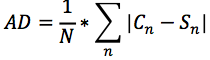
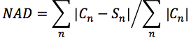
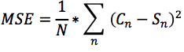
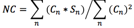
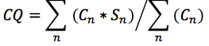
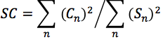

# gs-analyzator

*2015*

Разностные и корреляционные показатели искажения для оценки стеганографической системы: [gs-scrambler](https://github.com/Galarius/gs-scrambler).

| №|Название показателя|Формула|
| -------- | -------- | -------- |
| 1|Максимальная разность| |
| 2|Средняя абсолютная разность| |
| 3|Нормированная средняя абсолютная разность| |
| 4|Среднеквадратическая ошибка| |
| 5|Нормированная среднеквадратическая ошибка| |
| 6|Lp- норма, p = 2| |
| 7|Отношение «сигнал/шум»| |
| 8|Максимальное отношение «сигнал/шум»| |
| 9|Качество звучания| |
| 10|Нормированная взаимная корреляция| |
| 11|Качество корреляции| |

## Лицензия

Исходный код «gs-analyzator выложен на условиях [GNU GPLv3](https://choosealicense.com/licenses/gpl-3.0/#)
